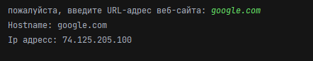

**Get Ip By Host**

**Author:** @ArchieWh1te

**Language:** Python 3.8

**Library pypi:** socket

**License:** Free

### Скрипт который выводит по запросу IP адрес

**Описание:**

Для работы скрипта запускаем файл **main.py** далее вводим *URL-адрес веб-сайта* и получаем информацию в терминал.

### Скриншот

**Вывод в терминал**

